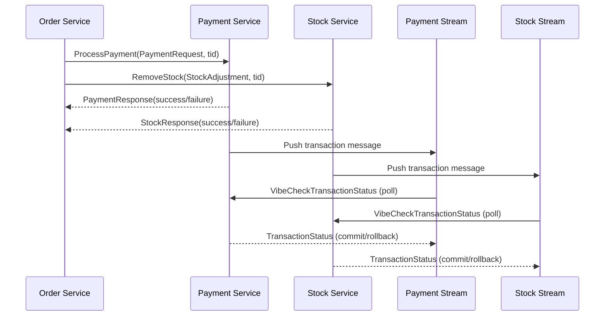

# Web-scale Data Management Project Template

## 📖 Introduction
This project serves as a scalable and distributed data management system.

It is built with a microservices architecture to efficiently handle orders, payments, and inventory management.

## ⚠️ Instructions
### ‼️ 1. Consistency Test :
We enhanced the consistency test provided in the benchmark. 
The initial version did not account for eventual consistency, which we have implemented, as it only checked the immediate final state of the system.
It also verified only successful transactions, but does not account for failed transactions.

Our system becomes consistent after a while, but the test does not wait for that to happen.

To account for this, we wrote a new consistency test that allows the user to rerun the check for consistency multiple times until the system eventually becomes consistent.
Our consistency test can be run with the following command:
`test`

As currently we ensure eventual consistency, you should allow the system to synchronize and retry the test a couple of times (3-5) before concluding that the system is inconsistent.

### 😵 2. What can be killed :
Not the database.
Everything except the database.

### 🏗️ 3. Scaling the system for better performance: 
- Order Service: In ```order-service```, modify the number of replicas by changing the ```replicas``` value in ```deployment```.

- Stock Service: In ```stock-service```, ```stock-rpc```, ```stock-stream``` the number of replicas can be changed by modifying the ```replicas``` value in the ```deployment``` section.

- Payment Service: In ```payment-service```, ```payment-rpc```, ```payment-stream``` the number of replicas can be changed by modifying the ```replicas``` value in the ```deployment``` section.

- Locust: For Locust, the ```worker``` container can be scaled to use multiple replicas by changing the ```replicas``` value in the deployment section.

## 👥 Contributors
- 🐐 [Yigit Çolakoğlu](https://github.com/arg3t)
- 🐐 [Andra Alăzăroaie](https://github.com/andra1782)
- 🐐 [Albert Sandu](https://github.com/albsd)
- 🐐 [Alexandra Căruțașu](https://github.com/adduta)
- 🐐 [Adrian Munteanu](https://github.com/cedbanana)

## 🏗️ Core Components
### 🛒 Order Service
Coordinates transactions and manages the user shopping cart
### 💳 Payment Service
Handles user credit management and payment processing
### 📦 Stock Service
Manages inventory tracking and stock adjustments
### 🔴 Redis (Database)
Primary database for all services
### 🔗 gRPC (Server Communication)
Communication protocol between services

## 🛠️ Implementation Details
### ⚡ Asynchronous Communication
- Our project utilizes **Quart (async Flask)** for handling **concurrent requests**
- Uses **asyncio** for non-blocking I/O operations
- Improves performance under high load conditions

### 🔄 Communication Protocol
Services communicate using **gRPC**, which offers several advantages over REST:
- Binary protocol (more efficient than JSON)
- Strong typing with Protocol Buffers
- Bidirectional streaming capabilities
- Lower latency

### 🔀 Transaction Protocol
We implemented a **Choreography-based Saga** pattern to manage distributed transactions across the Order, Payment, and Stock microservices.

### 💃 Saga Pattern:
<table>
  <tbody>
    <tr>
      <th>Order</th>
      <th>Stock</th>
      <th>Payment</th>
    </tr>
    <tr>
      <td><ol>
        <li>sends a request to Stock and Payment to deduct the amount for that order/li>
        <li>waits for the response from Stock and Payment</li>
        <li>if both are successful, returns 200</li>
        <li>if any one of them fails, returns 400</li>
      </ol></td>
      <td><ol>
        <li>verifies product availability</li>
        <li>if sufficient stock is available, it deducts the items</li>
        <li>sends response to the Order service with the result of the deduction (success/failure)</li>
        <li>pushes the transaction id for this operation to the redis stream to be rolled back or committed</li>
        <li>listens to messages from the Payment service for this transaction, roll back if payment failed</li>
        <li>continuously process the transaction id stream and poll payment for its status. If payment is down, push back to stream</li>
      </ol></td>
      <td><ol>
        <li>verifies sufficient funds</li>
        <li>if sufficient funds are available, it deducts the amount</li>
        <li>sends response to the Order service with the result of the deduction (success/failure)</li>
        <li>pushes the transaction id for this operation to the redis stream to be rolled back or committed</li>
        <li>listens to messages from the Stock service for this transaction, roll back if stock failed</li>
        <li>continuously process the transaction id stream and poll stock for its status. If stock is down, push back to stream</li>
      </ol></td>
    </tr>
  </tbody>
</table>




### Consistency
to be updated
### Performance
to be updated