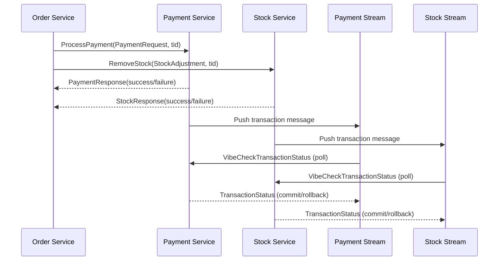

# Group 2 Web-scale Data Management Project

> [!IMPORTANT]
> **Note To Reader**
> Dear reader of this README, in case you do not have time and need to skip over
> some of this. We believe the following are must-reads:
> - [Architecture Overview](#architecture-overview)
> - [A Note on Our Consistency Model](#a-note-on-our-consistency-model)
> - [Choreographing Saga](#-choreography-based-saga-implementation)
> - [Core Components](#-core-components)

<details>
<summary>Table of Contents</summary>
<!-- TOC start (generated with https://github.com/derlin/bitdowntoc) -->

- [Group 2 Web-scale Data Management Project](#group-2-web-scale-data-management-project)
   * [📖 Introduction](#-introduction)
   * [A Note on Our Consistency Model](#a-note-on-our-consistency-model)
   * [Architecture Overview](#architecture-overview)
   * [⚠️ Instructions](#-instructions)
      + [‼️ 1. Consistency Test :](#-1-consistency-test-)
      + [‼️ 2. Performance Tests :](#-2-performance-tests-)
      + [😵 3. What can be killed :](#-3-what-can-be-killed-)
      + [🏗️ 4. Scaling the system for better performance:](#-4-scaling-the-system-for-better-performance)
   * [👥 Contributors](#-contributors)
   * [🏗️ Core Components](#-core-components)
      + [🔴 Redis (Database)](#-redis-database)
         - [Redis Lua Scripts for Atomic Actions](#redis-lua-scripts-for-atomic-actions)
         - [Redis Sentinel](#redis-sentinel)
      + [🔗 gRPC (Inter-Service Communication)](#-grpc-inter-service-communication)
      + [🛒 Order Service](#-order-service)
      + [📦 Stock Service](#-stock-service)
      + [💳 Payment Service](#-payment-service)
   * [🛠️ Implementation Details](#-implementation-details)
      + [⚡ Asynchronous Communication](#-asynchronous-communication)
      + [🔄 Communication Protocol](#-communication-protocol)
      + [🔀 Transaction Protocol](#-transaction-protocol)
      + [💃 Choreography-based Saga Implementation:](#-choreography-based-saga-implementation)
   * [🔄 Consistency Model](#-consistency-model)
      + [Quick Consistency](#quick-consistency)
         - [How It Works](#how-it-works)
         - [Verification](#verification)
   * [🚀 Performance Characteristics](#-performance-characteristics)
      + [⏱️ Benchmarks](#-benchmarks)
      + [🔍 Performance Optimizations](#-performance-optimizations)
      + [⚖️ Performance Tradeoffs](#-performance-tradeoffs)

<!-- TOC end -->
</details>

## 📖 Introduction
This project serves as a scalable and distributed data management system.

It is built with a microservices architecture to efficiently handle orders, payments, and inventory management.

## A Note on Our Consistency Model

Our system is designed to ensure eventual consistency when performing
transactions. However, we tried hard to go beyond the classical eventual
consistency model and keep our TTC (Time-To-Consistency) very low.

Our SAGA protocol is designed in a way such that transactions, which consist of
stock decrement, payment decrement and mark checkout actions, are committed to
the database only when we ensure a checkout is validated internally. This means
the time our system spends in an inconsistent state is considerably lower than
other applications.

Because of this, we prefer to refer to this consistency model as "Quick Consistency".

## Architecture Overview
The project implements a microservices-based system for transaction processing, built around three core services: Order, Payment, and Stock. These services communicate synchronously via gRPC for request handling and asynchronously through Redis streams for transaction coordination. The system employs Redis as its primary database, with Redis Sentinel providing high availability through automatic failover capabilities. 

The core of the system is a choreography-based Saga pattern that manages distributed transactions. When a checkout is initiated, the Order service coordinates with Payment and Stock services to validate and process the transaction. Each service records its transaction state in Redis streams, which are continuously monitored by dedicated stream processors. This approach allows the system to maintain data integrity even during partial service failures through compensating transactions.

The architecture implements what we call "Quick Consistency" - an optimized form of eventual consistency that minimizes the time services spend in inconsistent states. Transactions are committed to the database only after internal validation, significantly reducing the Time-To-Consistency (TTC). This design choice balances the performance benefits of asynchronous processing with the reliability needs of a transaction-based system.

Performance is enhanced through several optimizations, including asynchronous processing with asyncio, parallel execution of operations, and Redis Lua scripts for atomic actions. The system successfully handles 5,000+ concurrent transactions with response times averaging 300-400ms under normal load, and shows near-linear scaling when adding service replicas. The architecture prioritizes high availability and partition tolerance while ensuring data synchronization across all services.

## ⚠️ Instructions
### ‼️ 1. Consistency Test :
We enhanced the consistency test provided in the benchmark. The initial version
did not account for systems that took time to process all checkouts. Moreover, it also assumed all the transactions it attempted were successful,
but that is not always the case and the failed transactions need to be
accounted for when checking consistency.

We have implemented an enhanced test suite that addresses these problems by
allowing the user to re-run the check for consistency multiple times until all
checkouts are processed. Moreover, it also shows useful metrics pertaining to
the state of the system.

To run the consistency test, run the following commands in the terminal:
```sh
docker compose up --build -d
python tests/consistency/test.py
```

Or, if using PyCharm, you can click on the shortcut below after running command 1:
`test`

### ‼️ 2. Performance Tests :

For your convenience, our docker compose file also spins up a locust instance
with 3 workers. You can access it at `http://localhost:8089`. When you start the tests,
it also initializes users, stock and order automatically.

*You might have to click the start button twice.*

### 😵 3. What can be killed :
Try anything. :)

### 🏗️ 4. Scaling the system for better performance:
- **Order Service:** In ```order-service```, modify the number of replicas by changing the ```replicas``` value in ```deployment```.
- **Stock Service:** In ```stock-service```, ```stock-rpc```, ```stock-stream``` the number of replicas can be changed by modifying the ```replicas``` value in the ```deployment``` section.
- **Payment Service:** In ```payment-service```, ```payment-rpc```, ```payment-stream``` the number of replicas can be changed by modifying the ```replicas``` value in the ```deployment``` section.
- **Locust:** For Locust, the ```worker``` container can be scaled to use multiple replicas by changing the ```replicas``` value in the deployment section.

## 👥 Contributors
- 🐐 [Yigit Çolakoğlu](https://github.com/arg3t)
- 🐐 [Andra Alăzăroaie](https://github.com/andra1782)
- 🐐 [Albert Sandu](https://github.com/albsd)
- 🐐 [Alexandra Căruțașu](https://github.com/adduta)
- 🐐 [Adrian Munteanu](https://github.com/cedbanana)

## 🏗️ Core Components
### 🔴 Redis (Database)
Primary database for all services. Stores inventory, payment, and orders information.
#### Redis Streams

Redis Streams are used internally by the payment and order microservices to asynchronously
store and consume transactions that need to be processed. They allow us to have the obtain
the benefits of message queues without dealing with their additional overhead.

#### Redis Lua Scripts

We use Lua scripts to perform atomic actions in the redis database without the overhead of
creating transactions. We have lua scripts to atomically check if a value is greater than
another and if so, decrement it.

#### Redis Sentinel
Sentinel is a monitoring system provided by redis to catch database crashes and
do the failover function.More than one Sentinel can be deployed in a system.
Sentinel is being given the primary databases that it needs to watch and in
case it notices that one fails it sends a failover messages. Once the whole
quorum of Sentinels agrees on the failover, the replicas are being promoted to
master. The replicas of the system are automatically detected by the Sentinel
(it scans the whole networks trying to detect redis instances).

### 🔗 gRPC (Inter-Service Communication)
High-performance service communication protocol. Enables efficient cross-service communication.
### 🛒 Order Service
Coordinates transactions and manages the user shopping cart. Uses gRPC to call Payment and Stock services.

> It is important to note order only acts as a relay that sends decrement
> events to stock and payment. If one service's decrement action fails, it does
> not attempt a rollback and simply fails. The roll-back is eventually handled internally by the
> stock and payment services.
### 📦 Stock Service
Manages inventory tracking and stock adjustments. Capable of rollback operations for failed transactions.
### 💳 Payment Service
Handles user credit management and payment processing. Capable of rollback operations for failed transactions.

## 🛠️ Implementation Details
### ⚡ Asynchronous Communication
- Our project utilizes **Quart (async Flask)** for handling **concurrent requests**
- Uses **asyncio** for non-blocking I/O operations
- Improves performance under high load conditions

### 🔄 Communication Protocol
Services communicate using **gRPC**, which offers several advantages over REST:
- Binary protocol (more efficient than JSON)
- Strong typing with Protocol Buffers
- Bidirectional streaming capabilities
- Lower latency

### 🔀 Transaction Protocol
We implemented a **Choreography-based Saga** pattern to manage distributed transactions across the Order, Payment, and Stock microservices.

### 💃 Choreography-based Saga Implementation:
<table>
  <tbody>
    <tr>
      <th>🛒 Order Service</th>
      <th>📦 Stock Service</th>
      <th>💳 Payment Service</th>
    </tr>
    <tr>
      <td><ol>
        <li>Sends a request to Stock and Payment to deduct the amount for that order.</li>
        <li>Waits for the response from Stock and Payment.</li>
        <li>If both are successful, returns 200 as the checkout was successful.</li>
        <li>If any one of them fails, returns 400 and doesn't try again.</li>
      </ol></td>
      <td><ol>
        <li>Verifies product availability.</li>
        <li>If sufficient stock is available, it deducts the items.</li>
        <li>Sends response to the Order service with the result of the deduction (success/failure).</li>
        <li>Pushes the transaction ID for this operation to the Redis Stream to be rolled back or committed.</li>
        <li>Continuously listens to messages from the Payment service for this transaction and rolls back if payment deduction failed.</li>
        <li>Continuously process the transaction id stream and poll payment for its status. If payment is down, pushes back to stream.</li>
      </ol></td>
      <td><ol>
        <li>Verifies if the user has sufficient funds.</li>
        <li>If sufficient funds are available, it deducts the amount from its credit.</li>
        <li>Sends response to the Order service with the result of the deduction (success/failure).</li>
        <li>Pushes the transaction id for this operation to the Redis Stream to be rolled back or committed.</li>
        <li>Continuously listens to messages from the Stock service for this transaction and rolls back if stock deduction failed.</li>
        <li>Continuously process the transaction id stream and poll stock for its status. If stock is down, pushes back to stream.</li>
      </ol></td>
    </tr>
  </tbody>
</table>




## 🔄 Consistency Model

### Quick Consistency

Our system implements an **quick consistency** model across all
microservices, prioritizing availability and partition tolerance while ensuring
data synchronization over time.

#### How It Works

1. **Asynchronous Reconciliation**
   - Payment and Stock services record transaction states in Redis streams.
   - Dedicated stream processors continuously poll and process pending transactions.
   - When services recover from failures, they process backlogged transactions.

2. **Failure Handling**
   - If a service goes down during a transaction, other services queue the transaction ID
   - Upon recovery, the service processes the queue to maintain data integrity
   - The system handles both immediate and delayed compensation actions

3. **Benefits**
   - Higher availability during partial system failures
   - Better performance through parallel processing

4. **Tradeoffs**
   - Temporary inconsistency windows (typically few seconds)
   - More complex system design and testing
   - Requires careful transaction ID management

#### Verification

Our consistency testing accommodates the *quick* consistency model by:
- Allowing for multiple test runs to verify system convergence
- Checking both successful and failed transaction states
- Validating that compensating transactions are correctly applied

For accurate testing, run the consistency check multiple times with delays between executions to allow the system to achieve a consistent state.

## 🚀 Performance Characteristics
### ⏱️ Benchmarks
- **High Throughput:** Successfully processes 5,000+ concurrent transactions
- **Latency:** Typical transaction completion in 300-400ms under normal load
- **Scaling:** Near-linear performance scaling with additional service replicas
### 🔍 Performance Optimizations
- **Asynchronous Processing:** Non-blocking I/O with asyncio reduces wait times
- **Concurrent Operations:** Parallel execution of payment and stock operations
### ⚖️ Performance Tradeoffs
- **Consistency vs Speed:** Quick consistency model prioritizes performance over immediate consistency
