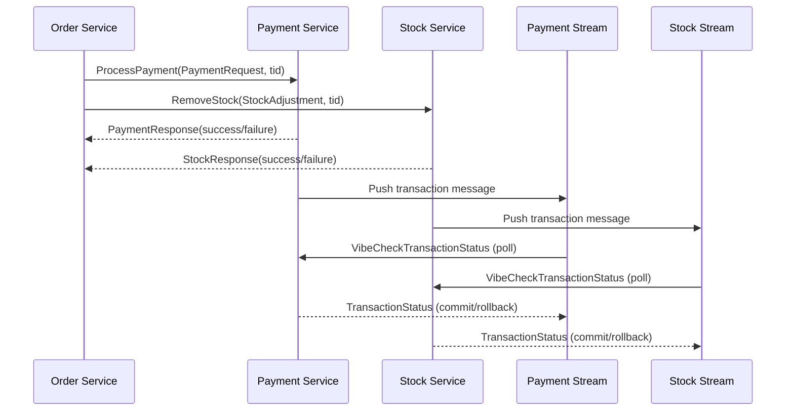

# Web-scale Data Management Project Template

## 📖 Introduction
This project serves as a scalable and distributed data management system.

It is built with a microservices architecture to efficiently handle orders, payments, and inventory management.

## ⚠️ Instructions
### ‼️ 1. Consistency Test :
We enhanced the consistency test provided in the benchmark. 
The initial version did not account for eventual consistency, which we have implemented, as it only checked the immediate final state of the system.
It also verified only successful transactions, but does not account for failed transactions.

Our system becomes consistent after a while, but the test does not wait for that to happen.

To account for this, we wrote a new consistency test that allows the user to rerun the check for consistency multiple times until the system eventually becomes consistent.
Our consistency test can be run with the following command:
`test`

As currently we ensure eventual consistency, you should allow the system to synchronize and retry the test a couple of times (3-5) before concluding that the system is inconsistent.

### 😵 2. What can be killed :
Not the database.
Everything except the database.

### 🏗️ 3. Scaling the system for better performance: 
- Order Service: In ```order-service```, modify the number of replicas by changing the ```replicas``` value in ```deployment```.

- Stock Service: In ```stock-service```, ```stock-rpc```, ```stock-stream``` the number of replicas can be changed by modifying the ```replicas``` value in the ```deployment``` section.

- Payment Service: In ```payment-service```, ```payment-rpc```, ```payment-stream``` the number of replicas can be changed by modifying the ```replicas``` value in the ```deployment``` section.

- Locust: For Locust, the ```worker``` container can be scaled to use multiple replicas by changing the ```replicas``` value in the deployment section.

## 👥 Contributors
- 🐐 [Yigit Çolakoğlu](https://github.com/arg3t)
- 🐐 [Andra Alăzăroaie](https://github.com/andra1782)
- 🐐 [Albert Sandu](https://github.com/albsd)
- 🐐 [Alexandra Căruțașu](https://github.com/adduta)
- 🐐 [Adrian Munteanu](https://github.com/cedbanana)

## 🏗️ Core Components
### 🔴 Redis (Database)
Primary database for all services. Stores inventory, payment, and orders information. 
### 🔗 gRPC (Server Communication)
High-performance service communication protocol. Enables efficient cross-service communication.
### 🛒 Order Service
Coordinates transactions and manages the user shopping cart. Uses gRPC to call Payment and Stock services
### 📦 Stock Service
Manages inventory tracking and stock adjustments. Capable of rollback operations for failed transactions.
### 💳 Payment Service
Handles user credit management and payment processing. Capable of rollback operations for failed transactions.


## 🛠️ Implementation Details
### ⚡ Asynchronous Communication
- Our project utilizes **Quart (async Flask)** for handling **concurrent requests**
- Uses **asyncio** for non-blocking I/O operations
- Improves performance under high load conditions

### 🔄 Communication Protocol
Services communicate using **gRPC**, which offers several advantages over REST:
- Binary protocol (more efficient than JSON)
- Strong typing with Protocol Buffers
- Bidirectional streaming capabilities
- Lower latency

### 🔀 Transaction Protocol
We implemented a **Choreography-based Saga** pattern to manage distributed transactions across the Order, Payment, and Stock microservices.

### 💃 Choreography-based Saga Implementation:
<table>
  <tbody>
    <tr>
      <th>🛒 Order Service</th>
      <th>📦 Stock Service</th>
      <th>💳 Payment Service</th>
    </tr>
    <tr>
      <td><ol>
        <li>Sends a request to Stock and Payment to deduct the amount for that order./li>
        <li>Waits for the response from Stock and Payment.</li>
        <li>If both are successful, returns 200 as the checkout was successful.</li>
        <li>If any one of them fails, returns 400 and doesn't try again.</li>
      </ol></td>
      <td><ol>
        <li>Verifies product availability.</li>
        <li>If sufficient stock is available, it deducts the items.</li>
        <li>Sends response to the Order service with the result of the deduction (success/failure).</li>
        <li>Pushes the transaction ID for this operation to the Redis Stream to be rolled back or committed.</li>
        <li>Continuously listens to messages from the Payment service for this transaction and rolls back if payment deduction failed.</li>
        <li>Continuously process the transaction id stream and poll payment for its status. If payment is down, pushes back to stream.</li>
      </ol></td>
      <td><ol>
        <li>Verifies if the user has sufficient funds.</li>
        <li>If sufficient funds are available, it deducts the amount from its credit.</li>
        <li>Sends response to the Order service with the result of the deduction (success/failure).</li>
        <li>Pushes the transaction id for this operation to the Redis Stream to be rolled back or committed.</li>
        <li>Continuously listens to messages from the Stock service for this transaction and rolls back if stock deduction failed<./li>
        <li>Continuously process the transaction id stream and poll stock for its status. If stock is down, pushes back to stream.</li>
      </ol></td>
    </tr>
  </tbody>
</table>




## 🔄 Consistency Model

### Eventual Consistency

Our system implements an **eventual consistency** model across all microservices, prioritizing availability and partition tolerance while ensuring data synchronization over time.

#### How It Works

1. **Asynchronous Reconciliation**
   - Payment and Stock services record transaction states in Redis streams.
   - Dedicated stream processors continuously poll and process pending transactions.
   - When services recover from failures, they process backlogged transactions.

2. **Failure Handling**
   - If a service goes down during a transaction, other services queue the transaction ID
   - Upon recovery, the service processes the queue to maintain data integrity
   - The system handles both immediate and delayed compensation actions

3. **Benefits**
   - Higher availability during partial system failures
   - Better performance through parallel processing

4. **Tradeoffs**
   - Temporary inconsistency windows (typically few seconds)
   - More complex system design and testing
   - Requires careful transaction ID management

#### Verification

Our consistency testing accommodates the eventual consistency model by:
- Allowing for multiple test runs to verify system convergence
- Checking both successful and failed transaction states
- Validating that compensating transactions are correctly applied

For accurate testing, run the consistency check multiple times with delays between executions to allow the system to achieve a consistent state.

## 🚀 Performance Characteristics
### ⏱️ Benchmarks
High Throughput: Successfully processes 5,000+ concurrent transactions

Latency: Typical transaction completion in 300-400ms under normal load

Scaling: Near-linear performance scaling with additional service replicas
### 🔍 Performance Optimizations
Asynchronous Processing: Non-blocking I/O with asyncio reduces wait times

Concurrent Operations: Parallel execution of payment and stock operations
### ⚖️ Performance Tradeoffs
Consistency vs Speed: Eventual consistency model prioritizes performance over immediate consistency